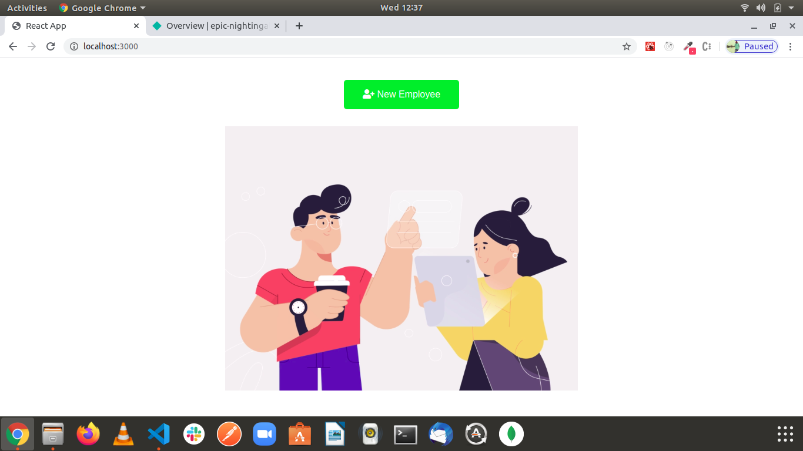
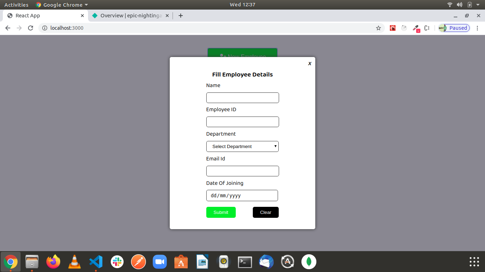
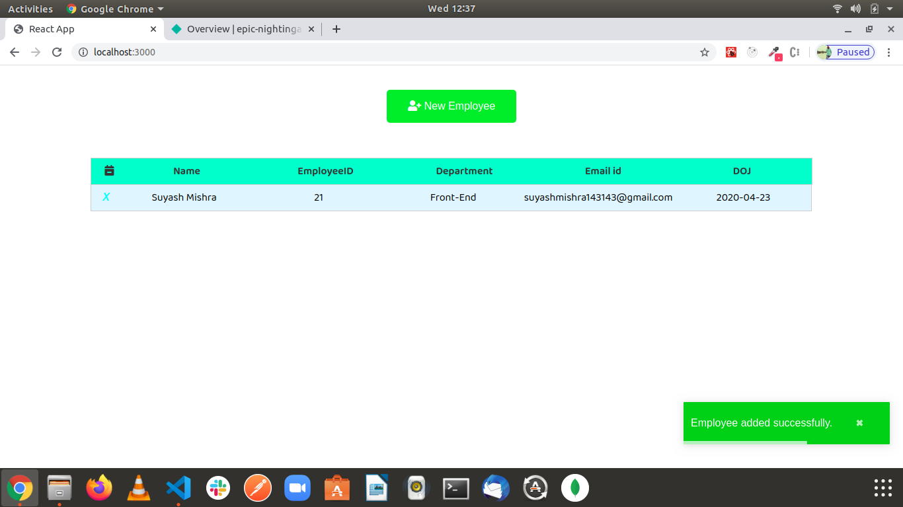

# Employee Management System

##### Preference will be given to folks who write the solution in ReactJS

##### Steps to Run project

`Clone The Repository`

`nmp install`

`npm start`

##### Steps

- Enter On Employee Button
- Form Will Be Pop up
- Enter Employee Details And Submit
- Delete Employee Details

#### Todo

- [x] Able to Add Employee
- [x] Able to Fill Form
- [x] Able to Show Details
- [x] Able to Delete Details

##### Screens

###### Home Screen

Able to Add Employee

Able to Fill Form

Able to Show Details

